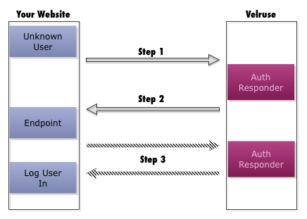

.. _architecture:

Architecture
============

Velruse implements an API similar to `RPXNow`_ to standardize the
way a web application handles user authentication. The standard flow of using
Velruse looks like this:

1. Website sends a POST to the :term:`auth provider`'s URL with an endpoint
   that the user should be redirected back to when authentication is complete
   and includes any additional parameters that the :term:`auth provider`
   requires.

2. When the :term:`auth provider` finishes the authentication, the user is
   redirected back to the endpoint specified with a POST, which includes the
   user's authentication data.

Auth Providers
--------------

Auth Providers implement all the messy details of authentication. Since they
listen to HTTP requests underneath their prefix, they can interact with other
systems that require redirects to authenticate. When the Auth Provider is done
it redirects back to the endpoint that it was provided with.

The Auth Provider is expected to respond to a POST to ``/login``, and then
proceed with the necessary calls and/or redirects necessary to complete
the authentication. Each provider is responsible for converting profile
data into a format compatible with `Portable Contacts`_.

Provider HTML Examples
----------------------

Every authentication provider that is available comes with a basic HTML 
example illustrating the parameters it requires. The template generally 
includes a logo when it's a third party :term:`identity provider` to help
a website user find the preferred authentication option.

.. note::

    While most websites will redirect to Velruse to handle the authentication
    for a user to login or register, the authentication can be done anytime
    for 'linking' an account to another provider as well.

.. _Portable Contacts: http://portablecontacts.net/draft-spec.html
.. _RPXNow: http://rpxnow.com/
